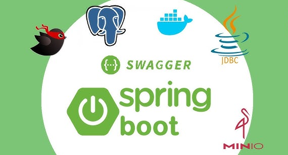
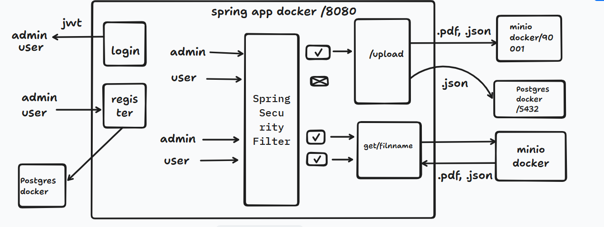
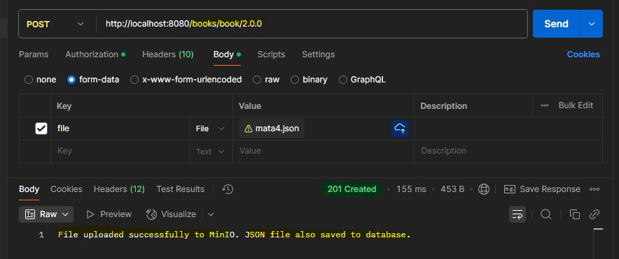
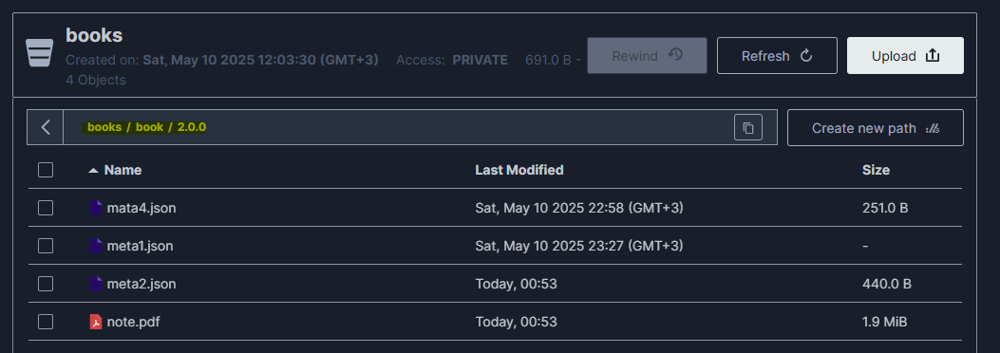
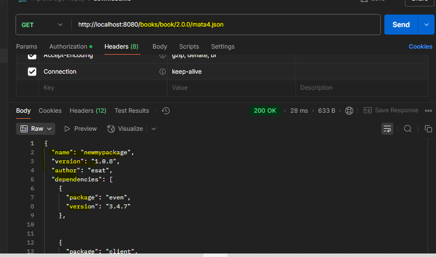
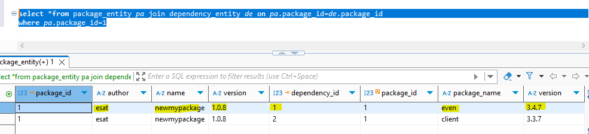
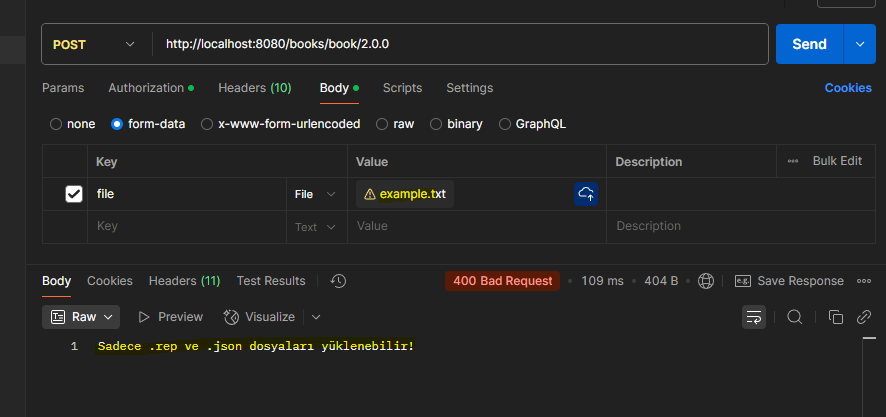

# SpringBoot-Postgres-Minio



# Project Structure



### 📖 Information

<ul style="list-style-type:disc">
  <li>MinIO is the only object storage suite available on
      every public cloud with supporting high-performance.</li>
  <li>It is API compatible with Amazon S3 cloud storage service</li>    
  <li>It can handle unstructured data such as photos, videos, log files, backups, and container images with (currently) the maximum supported object size of 5TB.</li>
  <li>Here is the explanation of the project
      <ul>
        <li>A deployment REST endpoint</li>
        <li>A download REST endpoint</li>
        <li>object-storage | file-system 2 Storage Strategy libraries</li>
        <li>Implement the process of uploading file to Minio</li>
        <li>Implement the process of downloading file from Minio</li>
        <li>During uploading .jon file to Minio also posgres database are saved  </li>   
        <li> JWT integration and authorization have been implemented for the API. </li>   
      </ul>
  </li>
  

### 🔨 Run the App

<b>1 )</b> Install <b>Docker Desktop</b>. Here is the installation <b>link</b> : https://docs.docker.com/docker-for-windows/install/

<b>2 )</b> Open <b>Terminal</b> under <b>\ApiStorageVone\ApiStorage></b> folder to run on <b>Docker.yml </b> Container
```
    docker-compose up -d
```
<b>3 )</b> Open <b>Minio</b> in the Browser 
```
    127.0.0.1:9001
```
<b>4 )</b> Enter username and password minio
```
    username : minioadmin
    password : minioadmin
```
<b>5 )</b> Open <b>Posgres database</b> in the Browser 
```
    127.0.0.1:5432
    
```
<b>6 )</b> Enter username and password database
```
     POSTGRES_DB: docker
    POSTGRES_USER: postgres
    POSTGRES_PASSWORD: mysecretpassword
```
<b>7 )</b> Explore Rest APIs
<table style="width:100%">
  <tr>
    <th>Method</th>
    <th>Url</th>
    <th>Description</th>
    <th>Valid Request Body</th>
  </tr>
  
  <tr>
    <td>POST</td>
    <td>/register</td>
    <td>user register </td>
  </tr>  
  </tr>
  <tr>
    <td>POST</td>
    <td>/login</td>
    <td>user login</td>
  </tr>

  <tr>
    <td>POST</td>
    <td>/{bucketName}/{packagename}/{version}</td>
    <td> upload file to minio </td>
  </tr>
  
<tr>
       <td>GET</td>
       <td>/bucketName}/{packagename}/{version}/{objectName}</td>
       <td>download file</td>
       <td></td>    
  </tr>  
</table>

### Used Dependencies
* Spring Boot Web
* Minio
* Lombok
* postgresql
* spring-boot-devtools
* mapstruct
* Spring Security
* JWT 

## Valid Request Body


##### <a id="Register">Register -> http://localhost:8080/register</a>
```
Request Method:Post
Body : {

    "username":"Admin",
    "password": "****"
}
"If a user logs in with the username 'admin', they are assigned the ADMIN_ROLE."

"If someone registers with any other username, they receive the USER_ROLE."

"Before registration, add these roles to the rolesnew table:"

INSERT INTO rolesnew (id, name) VALUES (1, 'ROLE_USER') ON CONFLICT DO NOTHING;
INSERT INTO rolesnew (id, name) VALUES (2, 'ROLE_ADMIN') ON CONFLICT DO NOTHING;
```

##### <a id="Login">Login ->  http://localhost:8080/login</a>
```
Request Method:Post
Body:
{
    "username":"Admin",
    "password": "*****"

}
Responce:JWT
```

##### <a id="upload">Upload -> http://localhost:8080/{bucketname}/{packageName}/{version}</a>
```
    Request Method:Post
    bucketname : books
    packageName : book
    version : 2.0.0
    example: http://localhost:8080/books/book/2.0.0

-> Before uploading, create a bucket name in MinIO and add a new path.

-> Only .pdf and .json files are allowed for upload.

-> Only admin users have upload permissions.

-> For the .json file to be saved to the database, the JSON data structure must be as follows
{
  "name": "newmypackage",         // Package name
  "version": "1.0.8",            // Version number
  "author": "esat",              // Author name
  "dependencies": [             // List of dependencies
    {
      "package": "even",         // Dependency package name
      "version": "3.4.7"        // Required version
    },    
    {
      "package": "client",
      "version": "3.3.7"
    }
  ]
}
```


## Valid Request Params

##### <a id="download">Download File -> http://localhost:8080/{bucketname}/{packageName}/{version}/{fileName}</a>
```
   Request method : Get
   example : http://localhost:8080/books/book/2.0.0/mata.json
   GET requests are allowed for both user and admin roles
```
### Screenshots

<details>
<summary>Click here to show the screenshots of project</summary>
    <p> Figure 1 </p>
    
    <p> Figure 2 </p>
    
    <p> Figure 3 </p>
    
    <p> Figure 4 </p>
    
    <p> Figure 5 </p>
    
    
</details>
